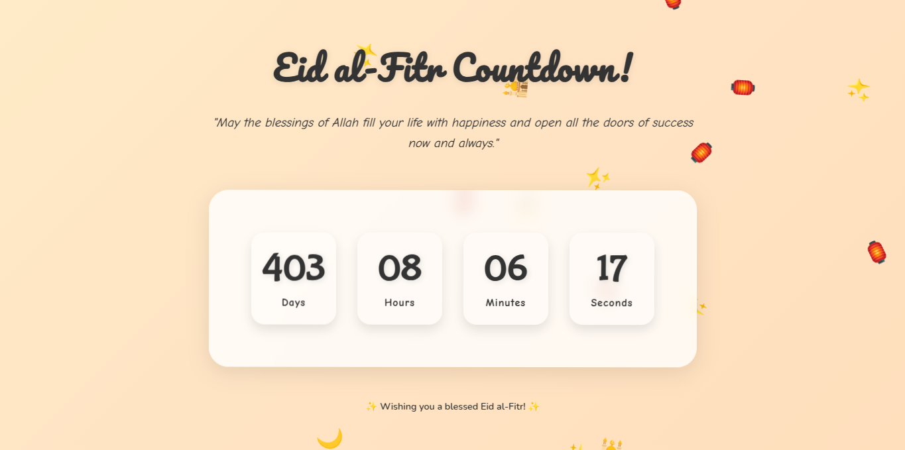

  

---
CountdownX is a simple and adorable countdown timer application. It allows you to set a countdown timer in a cute way using HTML.

  

---

<table><tr><td>New Year</td><td>Heart</td></tr><tr><td>
</td><td>
</td></tr></table>

<table><tr><td>Birtdays</td><td>Seasons</td></tr><tr><td>
</td><td>
</td></tr></table>

<table><tr><td>Festivals</td><td>Specials</td></tr><tr><td>
</td><td>
</td></tr></table>

  

---

- Set a countdown timer for any duration.
- Cute design
- Redirection support

  

---

> [!IMPORTANT]
> The times given in the code are not valid.
> Please change them as needed.

- New Year : [CountdownX NY](https://yashokuu.github.io/CountdownX/ny/)
- Heart : [CountdownX H](https://yashokuu.github.io/CountdownX/heart/)
- Birthday : [CountdownX BD](https://yashokuu.github.io/CountdownX/birthday/)
- Seasons : [CountdownX S](https://yashokuu.github.io/CountdownX/seasons/)
- Festivals: [CountdownX F](https://yashokuu.github.io/CountdownX/festival/)
- Specials : [CountdownX Sp](https://yashokuu.github.io/CountdownX/specials/)

  

---
Contributions are welcome! Please fork the repository and submit a pull request.

  

---

This project is licensed under the YASL License. See the [LICENSE](LICENSE.md) file for details.